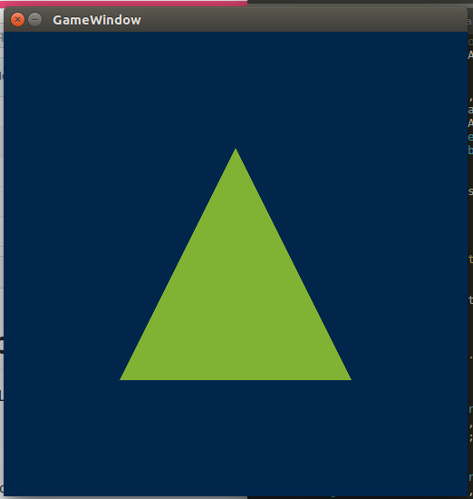

# Modern-OpenGL
OpenGL context in SDL, Vertex Buffer Objects and Shaders. 


### Terminal

```
g++ -std=c++11 main.cpp Game.cpp -o main -lSDL2 -lGLEW -lglut -lGL

```


#### Step 1: Setting up a window.


#### Step 2: Creating a mesh.

#### Step 3: Generating VBO and copying the relevant data into it.

#### Step 4: Generating VAO to keep track of VBO and attribute layouts.

#### Step 5: Shader loading,compilation & linking.

